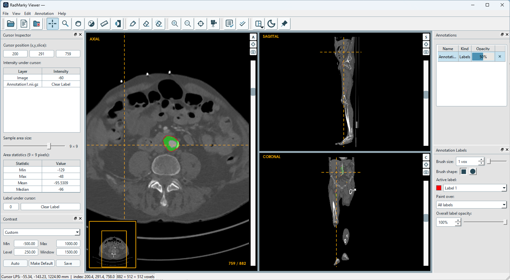
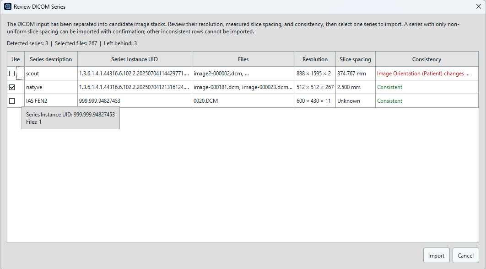
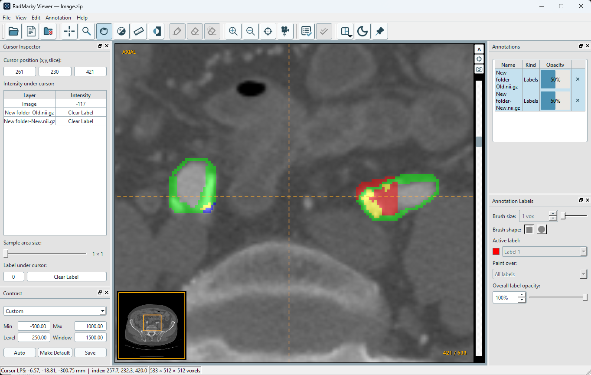
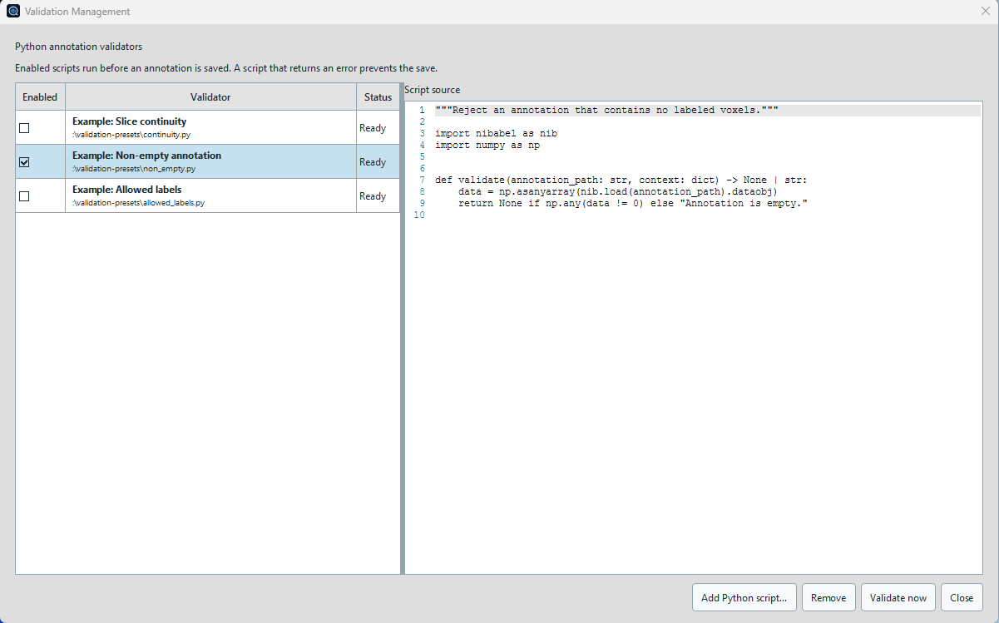
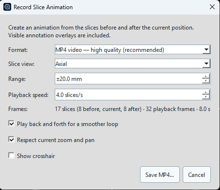

# RadMarky Viewer

RadMarky Viewer is a lightweight Windows desktop application for reviewing 3D
medical images and editing NIfTI label maps. It provides synchronized axial,
sagittal, and coronal views, geometry-aware DICOM import, annotation comparison
and editing, configurable validation, and still-image or animated export.

The application runs locally and is built with C++20, Qt 6, ITK, and VTK. It is
intended for research, education, and software evaluation. RadMarky Viewer is
not a certified medical device and must not be used as the sole basis for
diagnosis or treatment.

## Download

**Latest release candidate:**
[RadMarky Viewer 1.0.0-rc.2 for Windows x64](https://github.com/TensorHarmony/radmarky-viewer/releases/tag/v1.0.0-rc.2)

This is a prerelease intended for testing and evaluation. Please report
problems through [GitHub Issues](https://github.com/TensorHarmony/radmarky-viewer/issues).

## Feature tour

<table>
  <tr>
    <td width="50%" align="center">
      
    </td>
    <td width="50%">
      <h3>Synchronized patient-space viewing</h3>
      <p>Review axial, sagittal, and coronal slices around one shared cursor.
      Navigation, measurement, reslicing, overlays, and NIfTI round-tripping
      respect physical LPS origin, spacing, direction, and anisotropic voxels.</p>
    </td>
  </tr>
  <tr>
    <td width="50%">
      <h3>Smarter DICOM series import</h3>
      <p>Open loose files or nested archives and review every detected series
      before pixels are loaded. RadMarky separates mixed studies, can split
      distinct acquisitions that share a Series Instance UID, and proposes the
      largest consistent stack for import.</p>
    </td>
    <td width="50%" align="center">
      
    </td>
  </tr>
  <tr>
    <td width="50%" align="center">
      
    </td>
    <td width="50%">
      <h3>Layered annotation review</h3>
      <p>Overlay multiple label maps or scalar maps, tune each layer's opacity,
      and inspect values at the cursor. Compare two annotations with a
      categorical overlay that separates matching labels, conflicts, and
      regions unique to either layer.</p>
    </td>
  </tr>
  <tr>
    <td width="50%">
      <h3>Python-integrated annotation validation</h3>
      <p>Register and manage trusted Python validators, run them on demand, or
      invoke them automatically before saving a label map. A failed validation
      blocks the save with a clear message and can direct the reviewer to the
      affected axial slice.</p>
    </td>
    <td width="50%" align="center">
      
    </td>
  </tr>
  <tr>
    <td width="50%" align="center">
      
    </td>
    <td width="50%">
      <h3>Shareable image and animation export</h3>
      <p>Save the current view as PNG, JPEG, or BMP, or record nearby slices as
      MP4 or looping GIF. Exports can retain the current zoom, pan, crosshair,
      and visible annotation overlays.</p>
    </td>
  </tr>
</table>

Users familiar with ITK-SNAP and other orthogonal medical-image viewers should
feel at home with RadMarky's synchronized cursor, radiological display geometry,
and dockable inspection panels. RadMarky Viewer is an independent project.

## Getting started

1. Open one anatomical volume with **File > Open Images**, drag it into the
   window, or reopen it from **Recent images**.
2. Add one or more NIfTI annotations with **File > Open Annotations** or by
   dropping NIfTI files onto an open image.
3. Select a tool from the toolbar to navigate, change contrast, measure, paint,
   or erase. The controls beside the views expose window/level, annotations,
   labels, and cursor details.
4. Select one label-map annotation and use **Annotation > Save**. Enabled
   validators run before the file is written.

Recent-image entries retain file-backed annotation layers, their opacity, and
the active label. Missing files are reported rather than silently ignored.

## Detailed capabilities

### Image and DICOM input

- Open 3D NIfTI images (`.nii` and `.nii.gz`).
- Import loose DICOM files, `.zip` archives, and `.tar.gz` archives, including
  archives containing nested folders.
- Detect and separate multiple DICOM series before import, including distinct
  acquisitions that share a Series Instance UID.
- Review the detected series and select one consistent stack, or compatible
  parts sharing one Series Instance UID, to load.
- Validate slice position, orientation, dimensions, pixel spacing, frame of
  reference, duplicate instances, gaps, and stack uniformity before loading.
- Preserve uniform gantry tilt rather than flattening the image geometry.
- Search the loaded DICOM header in a key/value metadata table.
- Cancel long-running archive extraction or DICOM scanning.
- Reopen up to eight recent images from thumbnails and restore their saved
  annotation workspace.

### Viewing and inspection

- Navigate synchronized axial, sagittal, and coronal views with one crosshair.
- See physical LPS coordinates, continuous image indices, voxel intensity, and
  annotation values under the cursor.
- Inspect one voxel or statistics for a centered, visible-slice sample area from
  3x3 through 17x17, with an on-image box showing the sampled area.
- Scroll through physical slices, drag per-view scrollbars, edit the displayed
  cursor/slice position numerically, or click and drag the shared cursor.
- Zoom, pan, center, resize, or temporarily focus any slice view.
- Measure physical distance in millimetres with an on-image ruler.
- Adjust window/level interactively or numerically; use CT soft-tissue, lung,
  bone, and brain presets; save custom presets and a default display range.
- Invert grayscale, switch between light and dark themes, and keep the viewer
  above other applications.

### Annotations

- Overlay multiple NIfTI label maps or scalar maps with independent opacity.
- Infer useful layer names from annotation file paths when possible.
- Compare two annotations: red is present only in the first, blue only in the
  second, green is the same non-zero value in both, and yellow marks conflicting
  non-zero values.
- Create a blank label map aligned to the anatomical image.
- Paint or erase in the axial view with active labels and paint-over rules.
  Choose `Clear (Eraser)` from the label selector to erase; every label and the
  eraser retain independent brush-size and paint-over choices across application
  runs.
- Clear an 8-connected component on the current axial slice with scoped erase.
- Undo and redo complete brush, erase, or scoped-erase operations.
- Save edited label maps as `.nii` or `.nii.gz` while preserving image geometry.
- Prompt to save or discard modified annotations before closing or replacing an
  image.

### Validation

- Register, inspect, enable, disable, and remove Python annotation validators in
  **Validation Management**.
- Run enabled validators manually without saving, or automatically before every
  label-map save.
- Reject a save with a clear message and optionally move directly to the axial
  slice containing the issue.
- Start from bundled, disabled examples for non-empty, allowed-label, and slice
  continuity checks.

Validation scripts execute as separate processes with the current user's
permissions; they are not sandboxed. Add only scripts you trust. The validator
contract and interpreter discovery are documented in
[docs/VALIDATION.md](docs/VALIDATION.md).

### Export

- Save the current axial, sagittal, or coronal slice as PNG, JPEG, or BMP.
- Record a configurable physical range around the current slice as MP4 or GIF.
- Choose the view, playback speed, back-and-forth looping, current zoom/pan, and
  crosshair visibility. Visible annotation overlays are included.

## Current scope

RadMarky Viewer focuses on 2D orthogonal review and lightweight axial label-map
editing. It does not currently provide a 3D volume or mesh view, registration,
automated annotation, or oblique reformatting. Opening another anatomical
volume closes the current annotation workspace after resolving unsaved edits.

Windows x64 with Visual Studio 2022 is the tested build configuration. The CMake
project contains portable code paths, but other operating systems are not
covered by repository presets or documented as supported.

## Build from source

### Requirements

- Windows x64
- CMake 3.25 or newer
- Visual Studio 2022 with the **Desktop development with C++** workload
- Python 3.11 or newer
- [vcpkg](https://github.com/microsoft/vcpkg), bootstrapped locally

Set `VCPKG_ROOT` to your vcpkg checkout before configuring. Dependencies are
declared in [vcpkg.json](vcpkg.json) and include Qt, ITK, VTK, giflib, FFmpeg
with libx264, and libarchive. MP4 encoding uses the linked FFmpeg libraries; no
separate `ffmpeg.exe` is required. The first manifest install can take
considerable time because ITK and VTK are large C++ dependencies.

```powershell
$env:VCPKG_ROOT = 'C:\path\to\vcpkg'
cmake --preset release
cmake --build --preset release --target radmarky_viewer
```

The executable is written to:

```text
build/release/Release/radmarky_viewer.exe
```

After the initial configure has installed the dependencies, the helper script
can build, test, and launch the existing Release tree:

```powershell
.\build-release.ps1 -Test -Launch
```

## Run the tests

```powershell
$env:VCPKG_ROOT = 'C:\path\to\vcpkg'
cmake --build --preset release --target ALL_BUILD
ctest --preset release
```

The test suite covers image geometry and physical transforms, NIfTI I/O, DICOM
series validation, safe archive extraction, annotation comparison and editing,
window/level behavior, settings and recent workspaces, cursor sampling, VTK
orthogonal reslicing, animation export, Python validation, and related UI
behavior.

## Static analysis and benchmarks

The clang-tidy configuration is in [.clang-tidy](.clang-tidy). The helper
reuses the existing Release `vcpkg_installed` tree and does not reconfigure
CMake or rebuild ITK or VTK:

```powershell
.\tools\run-clang-tidy.ps1
```

Add `-Tests` to include test sources. After CMake has been configured, the same
command is available as the `clang_tidy` target. The report is written to
`build/clang-tidy/report.txt`.

For repeatable DICOM loader measurements, build and run the manual benchmark.
With no argument it generates a temporary 256x256x128 study; pass a directory
to measure representative local data instead:

```powershell
cmake --build --preset release --target radmarky_dicom_performance
.\build\release\tests\Release\radmarky_dicom_performance.exe
.\build\release\tests\Release\radmarky_dicom_performance.exe D:\path\to\study
```

## Project structure

```text
src/app/         Application metadata and persistent user settings
src/core/        Volumes, geometry, annotations, and viewer state
src/io/          NIfTI, DICOM, archive, GIF, and MP4 I/O
src/rendering/   ITK-to-VTK bridge, reslicing, overlays, and interactions
src/ui/          Qt windows, dialogs, themes, and tool panels
src/validation/  Python validation process and annotation validation service
tests/           Unit and integration-style CTest targets
resources/       Application artwork and bundled validation presets
```

The current design is documented in
[docs/ARCHITECTURE.md](docs/ARCHITECTURE.md), prospective work is tracked in
[docs/ROADMAP.md](docs/ROADMAP.md), implementation rules are collected in
[docs/DEVELOPMENT.md](docs/DEVELOPMENT.md), and the annotation validator
contract is described in [docs/VALIDATION.md](docs/VALIDATION.md).

## Contributing

Bug reports and feature requests are welcome as issues. Pull requests are
reserved for existing project contributors or changes explicitly requested by
a maintainer; unsolicited pull requests will be closed without review. See
[CONTRIBUTING.md](CONTRIBUTING.md) for the project policy.

Do not include patient-identifiable medical data in issues, tests, or
screenshots.

Report suspected vulnerabilities privately according to
[SECURITY.md](SECURITY.md).

## License

RadMarky Viewer is licensed under the GNU General Public License v3.0. See
[LICENSE](LICENSE).

Copyright © 2026 TensorHarmony Technologies Inc.

This repository contains the desktop viewer only. The RadMarky name may later
be used for a separate annotation platform; that product is not this
application.
